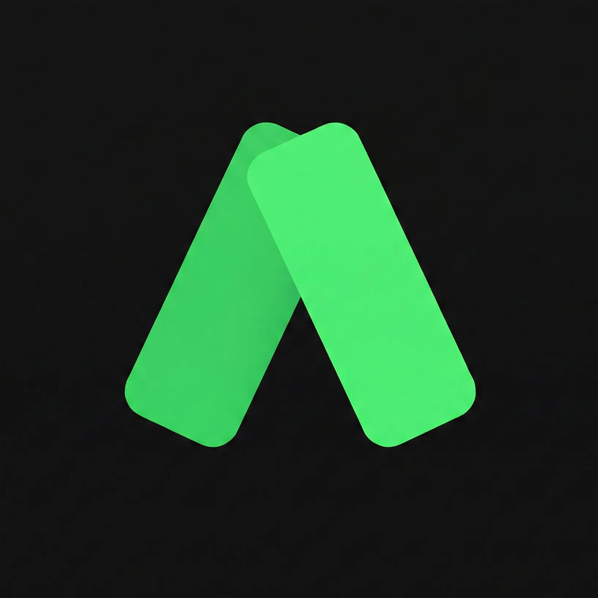
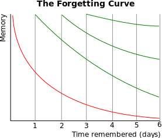

<p align="center">
  
</p>

<h1 align="center">Anki - 스마트 단어장</h1>

<p align="center">
  매일 조금씩, 잊지 않는 영어 학습<br>
  <strong>과학적인 간격 반복 시스템으로 단어를 오래 기억하세요</strong>
</p>

<p align="center">
  
  
  
  
</p>

---

## 🎯 이런 분들을 위해 만들었어요

| | |
|:---|:---|
| 📚 | 단어를 외워도 금방 잊어버리는 분 |
| 🔄 | 매일 꾸준히 영어 공부 습관을 만들고 싶은 분 |
| 📝 | 토익, GRE 등 시험 준비로 어휘력이 필요한 분 |
| ✈️ | 해외여행, 일상 회화를 준비하는 분 |

---

## ✨ 주요 기능

<table>
  <tr>
    <td width="50%">
      <h3>🧠 스마트 복습 시스템</h3>
      <p>모든 단어를 똑같이 외우지 않습니다. 어려운 단어는 자주, 쉬운 단어는 적게 복습하여 효율적으로 학습할 수 있어요.</p>
    </td>
    <td width="50%">
      <h3>📂 맞춤형 덱 관리</h3>
      <p>목적에 맞는 단어장을 만들고 관리하세요. TOEIC, GRE, 여행 영어, 일상 회화 등 다양한 덱을 지원합니다.</p>
    </td>
  </tr>
  <tr>
    <td width="50%">
      <h3>📊 학습 진도 확인</h3>
      <p>오늘 복습할 단어, 새로 배울 단어, 완료한 단어를 한눈에 확인하세요.</p>
    </td>
    <td width="50%">
      <h3>↩️ 실수 되돌리기</h3>
      <p>잘못 답변했나요? 마지막 평가를 취소하고 다시 할 수 있어요.</p>
    </td>
  </tr>
</table>

---

## 🔬 SRS (Spaced Repetition System)

이 앱은 **SM-2 기반의 간격 반복 시스템**을 사용합니다. Anki에서 사용하는 것과 동일한 알고리즘으로, 과학적으로 검증된 방법으로 기억을 오래 유지시켜 줍니다.

### 왜 단어를 금방 잊어버릴까요?

<p align="center">
  
</p>

1885년 독일의 심리학자 헤르만 에빙하우스는 **망각 곡선**을 발견했습니다.

- 🔴 **빨간선**: 복습하지 않으면 하루 만에 70% 이상을 잊어버립니다
- 🟢 **녹색선**: 적절한 시점에 복습하면 기억이 점점 더 오래 유지됩니다

> 💡 핵심은 **잊어버리기 직전에 복습**하는 것입니다. 이 앱이 그 타이밍을 자동으로 계산해 드려요.

### 어떻게 작동하나요?

카드를 복습한 후 4단계로 자기 평가를 합니다:

| 평가 | 의미 | 다음 복습 |
|:---:|:---|:---|
| 🔴 **Again** | 전혀 기억나지 않음 | 처음부터 다시 학습 |
| 🟠 **Hard** | 어렵게 기억해냄 | 간격 조금 증가 |
| 🟢 **Good** | 적당히 기억해냄 | 간격 정상 증가 |
| 🔵 **Easy** | 너무 쉬움 | 간격 크게 증가 |

앱은 각 카드의 **난이도 계수(Ease Factor)**를 추적합니다:

```
쉽게 맞힌 카드    → 난이도 계수 ↑ → 복습 간격 ↑↑
어렵게 맞힌 카드  → 난이도 계수 ↓ → 복습 간격 ↓
```

이렇게 **개인화된 학습 곡선**으로 학습 시간을 최소화하면서 기억은 최대화할 수 있습니다.

---

## 📖 학습 방법

```
1️⃣ 카드 확인    →  앞면의 단어를 보고 뜻을 떠올려보세요
       ↓
2️⃣ 정답 확인    →  카드를 뒤집어 정답을 확인하세요
       ↓
3️⃣ 자기 평가    →  Again / Hard / Good / Easy 중 선택하세요
       ↓
4️⃣ 반복 학습    →  앱이 최적의 시점에 다시 보여드려요
```

---

## 🚀 시작하기

```bash
# 의존성 설치
npm install

# 앱 실행
npm start
```

---

## 🛠️ AI Tools

이 프로젝트는 다양한 AI 도구의 도움을 받아 만들어졌습니다.

| 용도 | 도구 |
|:---:|:---:|
| 🎨 디자인 | [Stitch](https://stitch.withgoogle.com/) |
| 💻 개발 | [Claude Code](https://claude.ai/code) |
| 📐 설계 및 덱 생성 | [Gemini](https://gemini.google.com/) |

---

<p align="center">
  
</p>

<p align="center">
  <em>과학적인 간격 반복으로 영어 어휘를 마스터하세요.</em>
</p>
